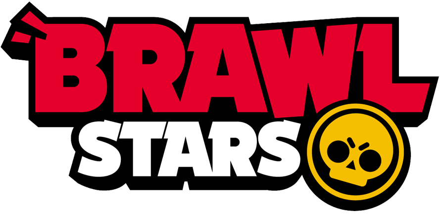
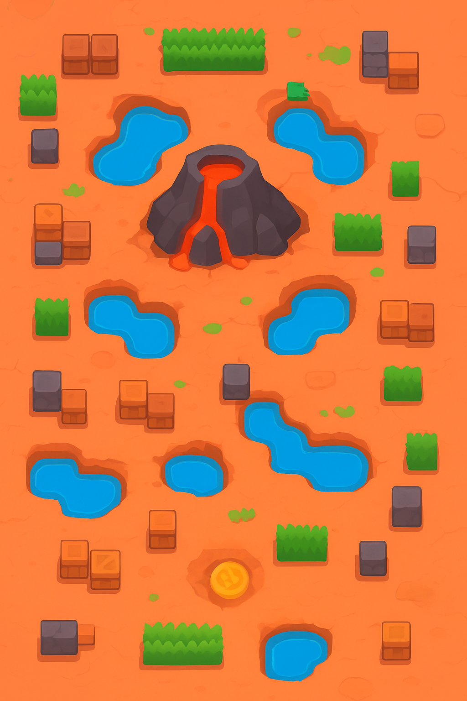

# REVISTA &emsp;  -->SUPERCELL<--  
&emsp;&emsp;&emsp;&emsp;&emsp;&emsp;&emsp;&emsp;&emsp;&emsp;&emsp;&emsp;

## Indice

[Clash Royale](#clash-royale)
[Clash of Clans](#clash-of-clans)
[Braws Stars](#braws-stars)

## CLASH ROYALE

### Actualizaciones (octubre)

   

* NUEVA TEMPORADA: ROCK & RULE
    1. *_COFRES DE LA SUERTE:_*
        +**Cofres de la suerte comunes**: cartas y oro (3 toques).
        +**Cofres de la suerte mágicos**: cartas, oro, objetos mágicos, fragmentos de evolución y personalizaciones, ¡como los cubos de la suerte! (4 toques).
        +**cofres de la suerte de temporada**: cambian en función de la temática de la temporada.
        +**Cofres de la suerte malditos (octubre)**: contienen una selección de cartas de temporada, fragmentos de evolución del ejército de esqueletos y del fantasma real y personalizaciones (4 toques).
        +**Cofres de la suerte fantasmales (octubre)**: contienen una selección de cartas de temporada, fragmentos de evolución del fantasma real y personalizaciones (4 toques).
       
    

    2. *_REDISEÑO DEL USO DE LOS CAMPEONES:_*
        El ciclo de tres cartas hacía que fuese muy difícil equilibrar a los campeones para quien jugaba de forma competitiva, mientras que el jugador medio raramente se aprovechaba de él. Para que lo importante sean los campeones y no el ciclado rápido.
       
        -El ciclo de los campeones ahora será idéntico al de las demás cartas.
        -Sin embargo, solo podrá usar la habilidad el último campeón que se haya jugado.
        -Y por si tener más de un campeón a la vez fuera poco, ¡el espejo ahora también funciona con ellos!.
    

    3.  *_NUEVAS EVOLUCIONES_*:

    **Ejército de esqueletos:** 
    
    

     -El general Ataúlfo lidera la evolución del ejército de esqueletos y, mientras siga con vida, volverá invisible e invulnerable a su pelotón. Sin embargo, cuando lo derroten, su leal ejército perecerá con él.

     +Fantasma real :

    +La evolución del fantasma real invoca dos soldados fantasmales que infligen daño al aparecer y protegen el espíritu de su líder cuando se materializa.
## CLASH OF CLANS

        * ¡EQUIPATE CON LA NUEVA ACTUALIZACIÓN!

   +**La torre multiusos entra en escena:**
    -Ataca tanto a las unidades aéreas como a las terrestres.
    -Tiene dos modos de defensa devastadores: largo alcance y ataque rápido.
    -¡Solo pone el punto de mira en una unidad, pero inflige muchísimo daño!

,,
    
  +**Una máquina de asedio nueva llega a la aldea:**
    -La lanzatropas es inmóvil, pero lo compensa con una fuerza de lanzamiento inmensa.
    -Cada barril puede albergar varias tropas convencionales y una tropa del castillo del clan.
    -La cantidad de barriles de la lanzatropas varía en función de su nivel, ¡así que úsalos bien!
    

## Braws Stars

### Nuevo Brawler legendario: :zap: "Voltix" llega para electrizar la arena :zap:

Supercell ha anunciado la llegada de un nuevo brawler legendario llamado *Voltix*. Se trata de un robot creado en el laboratorio de Ruffs que domina la electricidad y puede paralizar a los enemigos con descargas rápidas. Su ataque principal lanza rayos que rebotan entre rivales cercanos y su súper crea una zona que electrifica el suelo durante unos segundos, impidiendo el avance de los rivales.

Voltix estará disponible como parte de una nueva actualización temática llamada Tormenta Tecno. Llegará acompañado de nuevos aspectos, reacciones y un nuevo modo de juego llamado Circuito Caótico.

### Surge anuncia concierto dentro del juego con una nueva colaboración musical :notes:

Brawl Stars ha sorprendido nuevamente a sus fans anunciando oficialmente su primera colaboración musical con el cantante virtual NeonWave. El evento consistirá en un miniconcierto en el menú principal del juego, protagonizado por Surge DJ, que estrenará un nuevo aspecto exclusivo con temática de música electrónica.

Durante el evento, los jugadores podrán completar misiones musicales y conseguir recompensas como pines animados, sprays luminosos y monedas. También se espera que se añada música nueva a algunas pantallas del juego.

### Nuevas skins "Ciberpunk" revolucionan el pase de batalla :robot:

La próxima temporada de Brawl Stars tendrá una temática futurista inspirada en el estilo ciberpunk. Entre las skins confirmadas se encuentran:

* **Colt Neon**: Traje futurista con luces de neón y animaciones especiales en los disparos.
* **Shelly Cyborg**: Apariencia robótica con efectos visuales en su súper.
* **Spike Hacker**: Skins de hacker con ataques que dejan rastros brillantes en el suelo.

Además, los jugadores podrán:

1. Desbloquear un nuevo diseño para los menús del juego.
2. Conseguir reacciones con temática tecnológica.
3. Completar misiones especiales para obtener recompensas exclusivas.

### Supercell prueba un nuevo sistema de clanes con chat de voz :microphone:

Supercell ha comenzado a probar en servidores privados una nueva función social para Brawl Stars: clanes 2.0. Esta actualización introduce un chat de voz interno para partidas amistosas, logros de club por temporadas y opciones de personalización mejoradas para los presidentes.

También habrá guerras de clanes renovadas con recompensas únicas como gemas, monedas de club y reacciones exclusivas. Todavía no hay fecha oficial de lanzamiento, pero la comunidad espera verlo pronto en una beta pública.

### Se filtra posible rework de Dynamike :bomb:

Según rumores de la comunidad, Dynamike podría recibir un rework importante en sus habilidades para equilibrar su uso en partidas competitivas. Entre los cambios filtrados se encuentran una nueva mecánica que permitiría lanzar dinamita más rápido y una súper explosiva que destruye muros de forma diferente.

Aunque no hay confirmación oficial por parte de Supercell, los desarrolladores mencionaron hace unas semanas que algunos brawlers clásicos recibirán ajustes pronto, lo que aumenta las probabilidades de que el rework sea real.

### Brawl Stars lanza el nuevo mapa "Isla Volcánica" :volcano:

Supercell ha introducido un nuevo mapa llamado **Isla Volcánica**, diseñado para modos de juego 3 contra 3. El mapa combina zonas estrechas con áreas abiertas, y cuenta con obstáculos dinámicos que cambian de posición durante la partida, aumentando la estrategia requerida para ganar.

En palabras de **Lina Torres**, *diseñadora de mapas* en Brawl Stars:

> "Queríamos crear un mapa que mantuviera a los jugadores siempre alerta. Cada partida en la Isla Volcánica será diferente gracias a los obstáculos móviles y a los cambios en el terreno."

El nuevo mapa ya está disponible en el juego y los jugadores pueden disfrutar de recompensas exclusivas por completar partidas en él durante las primeras semanas.

